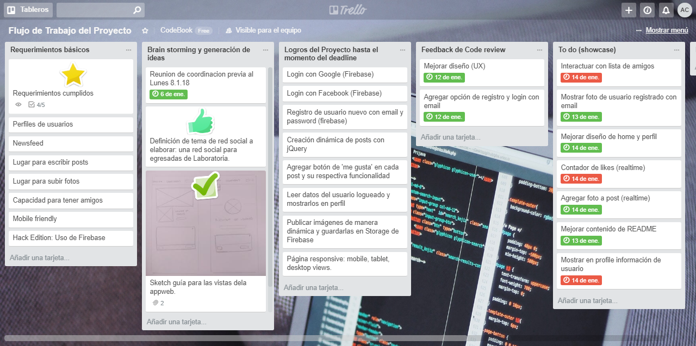
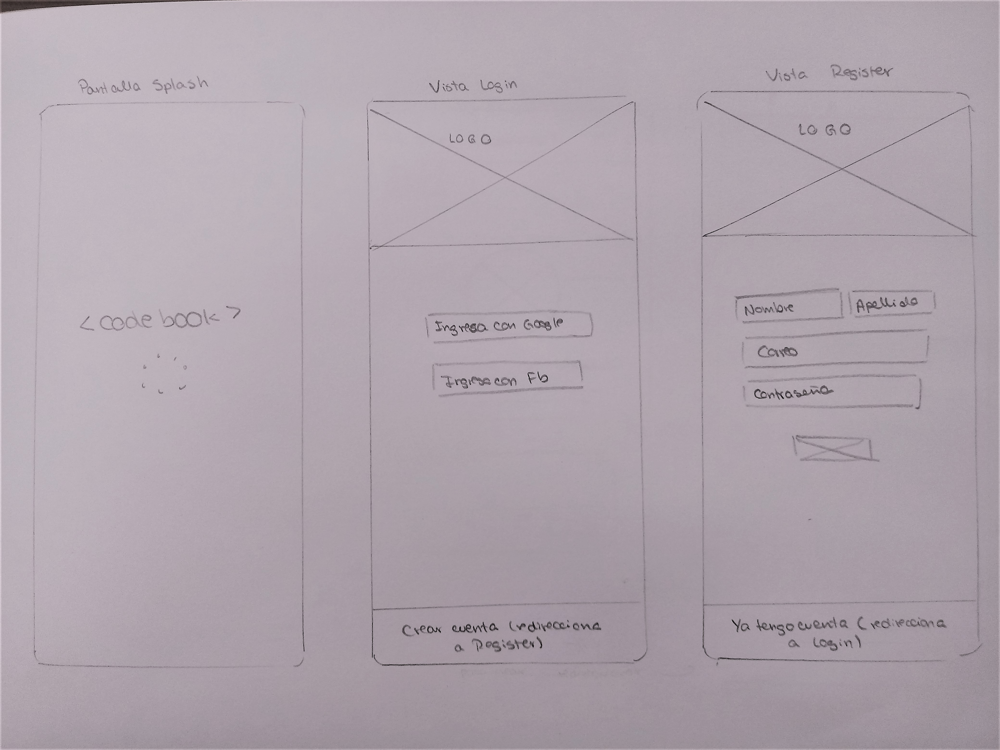
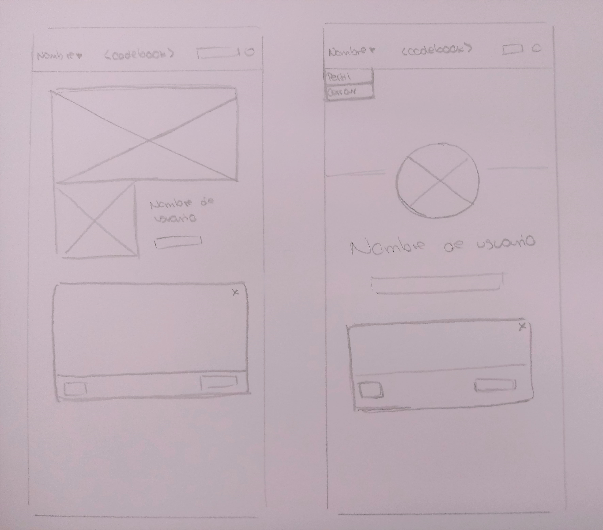
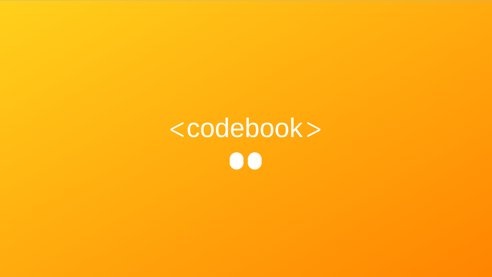
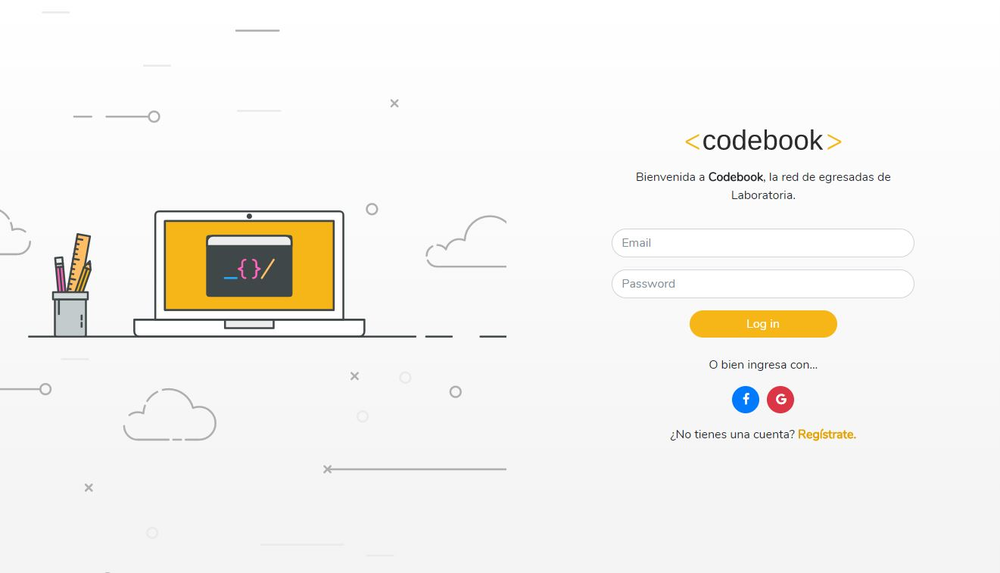
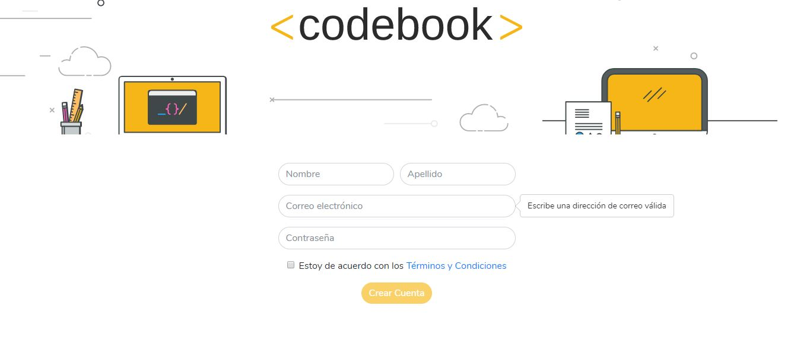
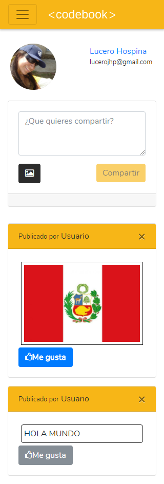
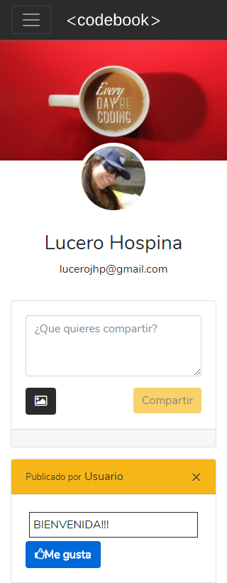

# CODEBOOK

Codebook es una red social de uso exclusivo para egresadas de los bootcamp de Laboratoria. Tiene como finalidad mantener unidas y actualizadas a las developers y designers.

## Desarrollado para [Laboratoria](http://laboratoria.la) 

## PRODUCTO FINAL - SPRINT 3

## Crea tu Propia Red Social

Para este proyecto se nos solicitó que desarrollemos una red social de nuestra preferencia empleando los conocimientos adquiridos hasta ahora en el bootcamp de Laboratoria-Lima.

## Flujo de trabajo

Para la planificación de las tareas a realizar optamos por utilizar Trello.

* El producto elegido para desarrollar fue una red social exclusiva para egresadas de Laboratoria a la que llamamos **CodeBook**.

* Trabajamos en parejas y como parte del proceso de creación ideamos los siguientes prototipos para el producto:

## Vistas del proyecto

A continuación, las vistas del producto entregado:

## Herramientas utilizadas

Sobre los conocimientos adquiridos puestos en práctica:

1. Empleamos la librería de **jquery**.

2. Escogimos **Bootstrap 4** como framework.

3. Empleamos **Firebase** para la autenticación de usuarios.

## Integrantes

[Andrea Chumioque](https://github.com/andrea-isabel)

[Lucero Hospina](https://github.com/lucerohospina)
